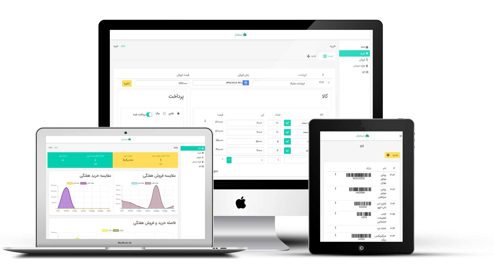
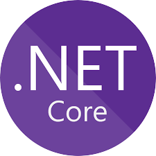

# حسابدار

<p>
  <sub>ساخته شده با ❤︎ توسط
    <a href="https://twitter.com/muhammad_vakili">محمد وکیلی</a>
  </sub>
</p>

حسابدار ابزاری  برای مدیریت ساده ی مالی فروشگاه های کوچک می باشد، به اندازه ای ساده که هر فروشنده ای بتواند با یک آموزش 5 دقیقه ای، فعالیت های مالی روزمره ی خود را با این ابزار منظم کند

## حسابدار چه امکاناتی دارد؟

- خرید و فروش کالا
- دریافت و پرداخت
- گزارش های شفاف

### پیش نمایش



## فروشندگان چه مشکلاتی دارند؟

- فروشنده امکان محاسبه ی سود و زیان روزانه ی خود را ندارد یا حوصله و وقت انجام این محاسبه را ندارد
- فروشنده به طور دقیق نمی داند که همکار ( شاگرد ) خود به چه مقدار فروش داشته اند
- فروشنده آمار خرید و فروش روز ها، هفته ها و ماه های قبل را فراموش می کند
- فروشنده نمی تواند بطور دقیق میزان پیشرفت و پسرفت سود مالی کسب و کار خود را محاسبه کند
- فروشنده برای محاسبه ی میزان بدهی و طلبکاری خود با طرف حساب های خود، باید زمان زیادی برای جمع و تفریق بگذارد
- فروشنده می خواهد منظم باشد، اما به دلیل رفت و آمد و فشار کار، امکان ایجاد نظم را ندارد
- فروشنده حوصله ی کار با کامپیوتر را ندارد 
- فروشگاه به اندازه ای بزرگ نیست که امکان استخدام یک حسابدار وجود داشته باشد

## چرا حسابدار ساخته شده؟

حسابدار ساخته شده تا یک فروشنده، بدون نیاز به مفاهیم و اصطلاحات تخصصی حسابداری فعالیت های مالی خود را به صورت منظم در آورد.

## برای توسعه دهنده

### تکنولوژی های استفاده شده




### پیش نیاز ها

Frontend:

- Node >= v5
- NPM >= v3
- Webpack v2
- VueJs >= v2
- BulmaJs v3
- Chart.js v1
- Electron v1
- Buefy v0.5.6

Backend:

- dotnetcore v2
- Microsoft.EntityFrameworkCore.SqlServer v2
- Microsoft.AspNetCore.All v2
- Swashbuckle.AspNetCore (Swagger UI) v1.1.0

### شروع استفاده - Backend

```bash
> cd backend/Hesabdar
> dotnet restore
> dotnet run
```

### شروع استفاده - Frontend

```bash
> cd frontend/
> yarn
// or > npm update

> yarn run dev
// or > npm run dev
```

## لایسنس


[MIT](https://github.com/mvakili/hesabdar/blob/master/LICENSE)